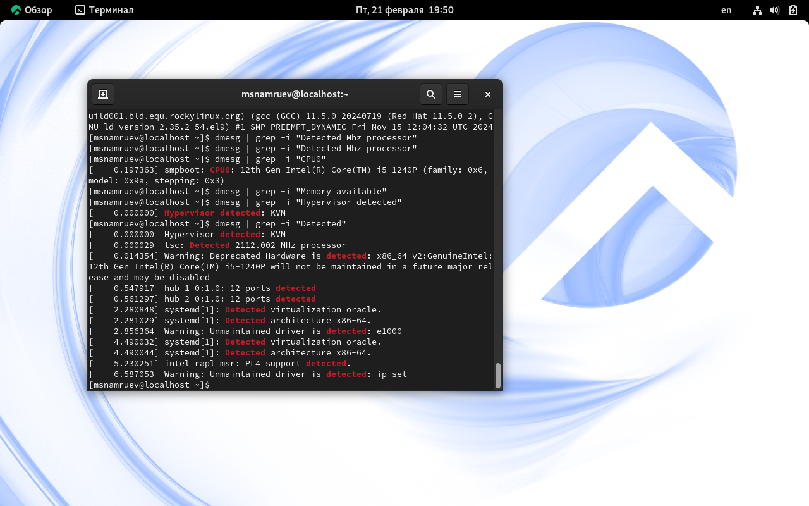

---
## Front matter
lang: ru-RU
title: Лабораторная работа №1
subtitle: Основы информационной безопасности 
author:
  - Намруев М. С.
institute:
  - Российский университет дружбы народов, Москва, Россия
date: 22 февраля 2025

## i18n babel
babel-lang: russian
babel-otherlangs: english

## Fonts
mainfont: IBM Plex Sans
romanfont: IBM Plex Sans
sansfont: IBM Plex Sans
monofont: IBM Plex Sans
mathfont: STIX Two Math
mainfontoptions: Ligatures=Common,Ligatures=TeX,Scale=0.94
romanfontoptions: Ligatures=Common,Ligatures=TeX,Scale=0.94
sansfontoptions: Ligatures=Common,Ligatures=TeX,Scale=MatchLowercase,Scale=0.94
monofontoptions: Scale=MatchLowercase,Scale=0.94,FakeStretch=0.9

## Formatting pdf
toc: false
toc-title: Содержание
slide_level: 2
aspectratio: 169
section-titles: true
theme: metropolis
header-includes:
 - \metroset{progressbar=frametitle,sectionpage=progressbar,numbering=fraction}
---

# Информация

## Докладчик

:::::::::::::: {.columns align=center}
::: {.column width="70%"}

  * Намруев Максим Саналович
  * студент, 2 курс, НКАбд-03-23
  * Российский университет дружбы народов
  * [1132236035@rudn.ru](mailto:1132236035@rudn.ru)
  * <https://msnamruev.io/ru/>

:::
::: {.column width="30%"}

:::
::::::::::::::

## Цель работы

Целью данной работы является приобретение практических навыков
установки операционной системы на виртуальную машину, настройки ми-
нимально необходимых для дальнейшей работы сервисов.

## Задание

1. Настройка Виртуальной машины

2. Установка имени пользователя и названия хоста

3. Домашняя работа

## Выполнение лабораторной работы

Создаю новую виртуальную машину, указывая её имя и тип операционной системы. 

## Выполнение лабораторной работы

Далле задаю размер основной виртуальной памяти ВМ 

## Выполнение лабораторной работы

Задаю конфигурацию жесткого диска и размер диска. 

## Выполнение лабораторной работы

Запускаю ВМ и выбираю язык настройки. 

## Выполнение лабораторной работы

В разделе выбора программ указываю в качестве базового окружения сервер и GUI, а в качестве дополнения Средства разработки. 

## Выполнение лабораторной работы

Устанавливаю пароль для root и пользователя с правами администратора. 

## Выполнение лабораторной работы

Устанавливаю операционную систему и перезапускаю её.

## Выполнение лабораторной работы

после перезагрузки вхожу в ОС под созданной мной учетной записью. 

## Выполнение лабораторной работы

в меню устройтва подключаю образ дополнений гостевой ОС. 

## Выполнение лабораторной работы

Загуржаю его и потом перезагружаю ОС.

### Установка имени пользователя и названия хоста

Так как имя хотса у меня было правильное пропускаю этот шаг.

ЛОЛ

## Домашнее задание

Использую команду dmesg.

## Домашнее задание

С помощью посика нахожу информацию о Версии ядра Linux.

## Домашнее задание

С помощью посика нахожу информацию о Частоте процессора.

## Домашнее задание

С помощью посика нахожу информацию о Модели процессора.

## Домашнее задание

С помощью посика нахожу информацию о Объеме доступной оперативной памяти.

## Домашнее задание

С помощью посика нахожу информацию о типе обнаруженного гипервизора.

## Домашнее задание

С помощью посика нахожу информацию о Типе файловой системы корневого раздела.

## Выводы

после выполения данной лабораторной работы я установил rocky linux на ВМ 

