---
## Front matter
title: "Лабораторная работа №1"
subtitle: "Информационная безопасность"
author: "Намруев Максим Саналович"

## Generic otions
lang: ru-RU
toc-title: "Содержание"

## Bibliography
bibliography: bib/cite.bib
csl: pandoc/csl/gost-r-7-0-5-2008-numeric.csl

## Pdf output format
toc: true # Table of contents
toc-depth: 2
lof: true # List of figures
lot: true # List of tables
fontsize: 12pt
linestretch: 1.5
papersize: a4
documentclass: scrreprt
## I18n polyglossia
polyglossia-lang:
  name: russian
  options:
	- spelling=modern
	- babelshorthands=true
polyglossia-otherlangs:
  name: english
## I18n babel
babel-lang: russian
babel-otherlangs: english
## Fonts
mainfont: IBM Plex Sans
romanfont: IBM Plex Sans
sansfont: IBM Plex Sans
monofont: IBM Plex Sans
mathfont: STIX Two Math
mainfontoptions: Ligatures=Common,Ligatures=TeX,Scale=0.94
romanfontoptions: Ligatures=Common,Ligatures=TeX,Scale=0.94
sansfontoptions: Ligatures=Common,Ligatures=TeX,Scale=MatchLowercase,Scale=0.94
monofontoptions: Scale=MatchLowercase,Scale=0.94,FakeStretch=0.9
mathfontoptions:
## Biblatex
biblatex: true
biblio-style: "gost-numeric"
biblatexoptions:
  - parentracker=true
  - backend=biber
  - hyperref=auto
  - language=auto
  - autolang=other*
  - citestyle=gost-numeric
## Pandoc-crossref LaTeX customization
figureTitle: "Рис."
tableTitle: "Таблица"
listingTitle: "Листинг"
lofTitle: "Список иллюстраций"
lotTitle: "Список таблиц"
lolTitle: "Листинги"
## Misc options
indent: true
header-includes:
  - \usepackage{indentfirst}
  - \usepackage{float} # keep figures where there are in the text
  - \floatplacement{figure}{H} # keep figures where there are in the text
---

# Цель работы

Целью данной работы является приобретение практических навыков
установки операционной системы на виртуальную машину, настройки ми-
нимально необходимых для дальнейшей работы сервисов.

# Задание

1. Настройка Виртуальной машины

2. Установка имени пользователя и названия хоста

3. Домашняя работа

# Выполнение лабораторной работы

Создаю новую виртуальную машину, указывая её имя и тип операционной системы. (рис. [-@fig:001]).

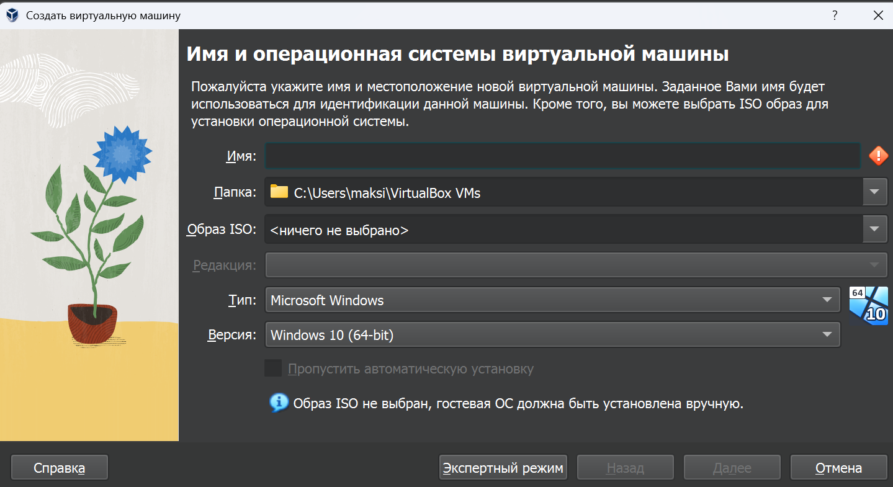{#fig:001 width=70%}

Далле задаю размер основной виртуальной памяти ВМ (рис. [-@fig:002]).

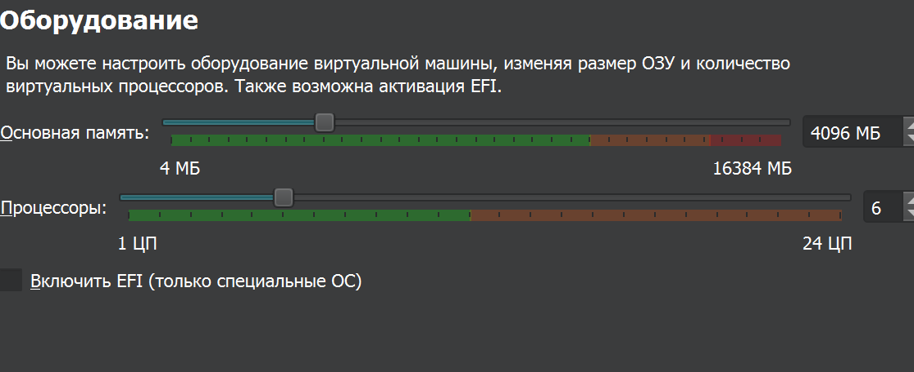{#fig:002 width=70%}

Задаю конфигурацию жесткого диска и размер диска. (рис. [-@fig:003]).

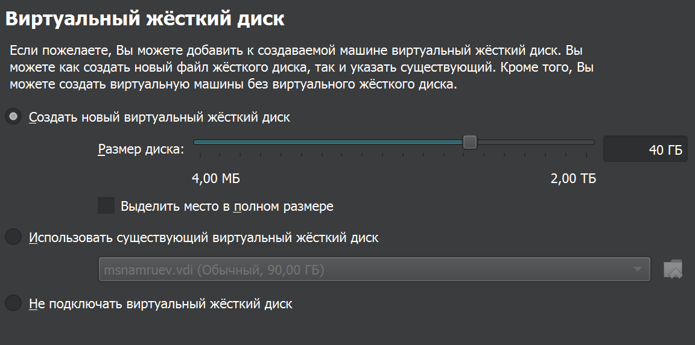{#fig:003 width=70%}

Запускаю ВМ и выбираю язык настройки. (рис. [-@fig:004]).

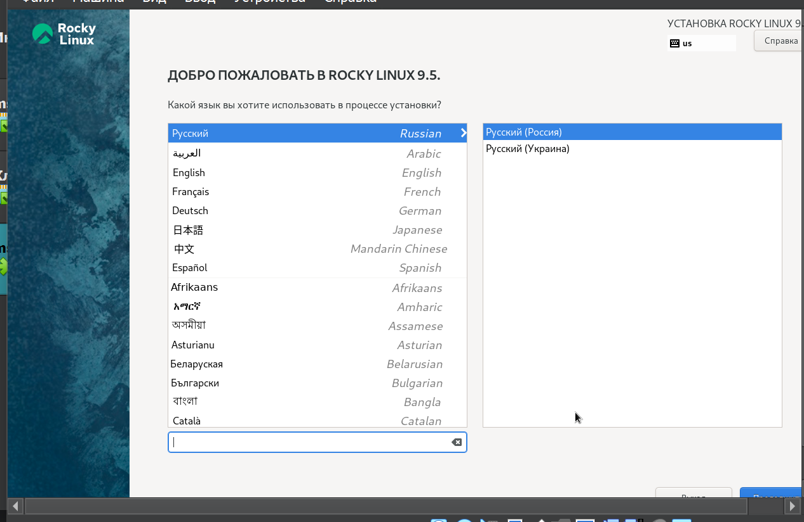{#fig:004 width=70%}

В разделе выбора программ указываю в качестве базового окружения сервер и GUI, а в качестве дополнения Средства разработки. (рис. [-@fig:005]).

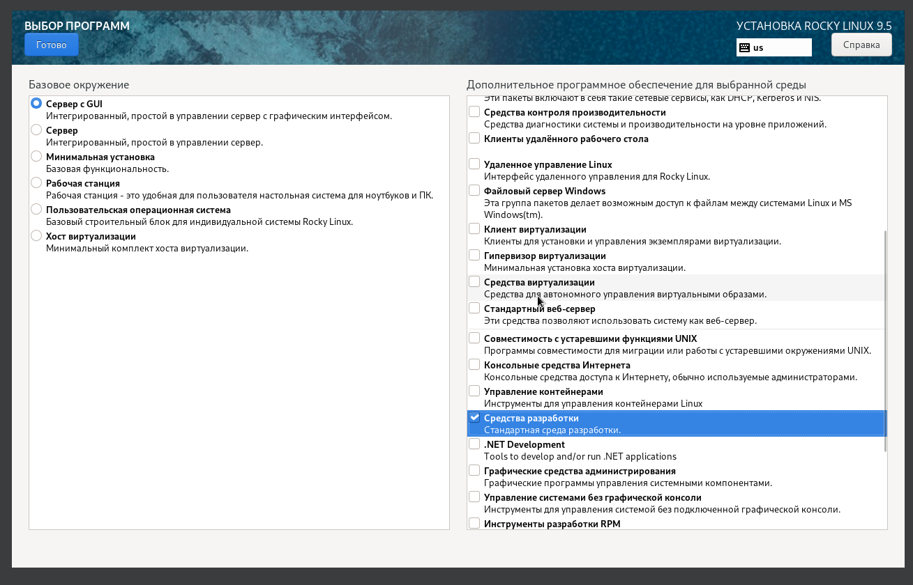{#fig:005 width=70%}

Устанавливаю пароль для root и пользователя с правами администратора. (рис. [-@fig:006]).

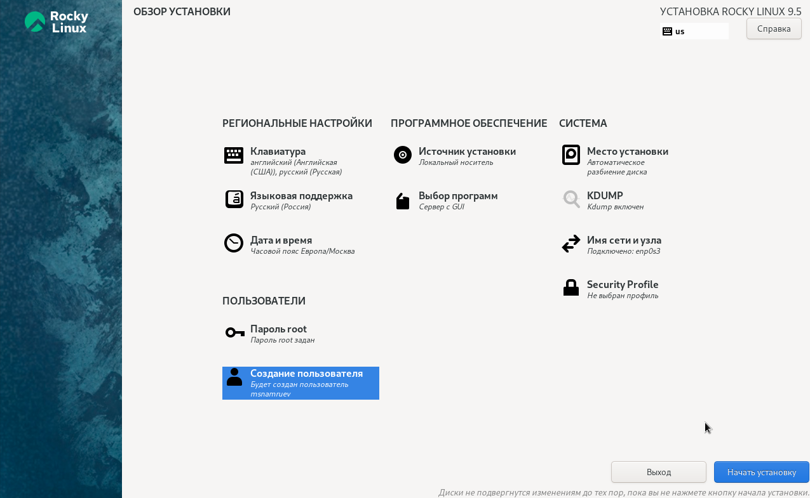{#fig:006 width=70%}

Устанавливаю операционную систему и перезапускаю её.(рис. [-@fig:007]).

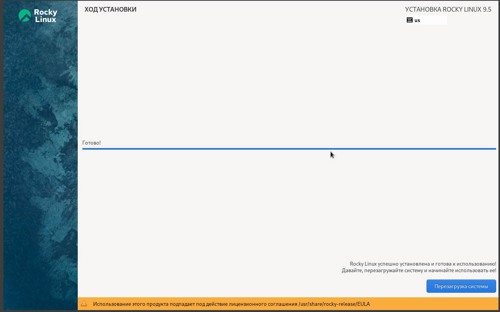{#fig:007 width=70%}

после перезагрузки вхожу в ОС под созданной мной учетной записью. (рис. [-@fig:008]).

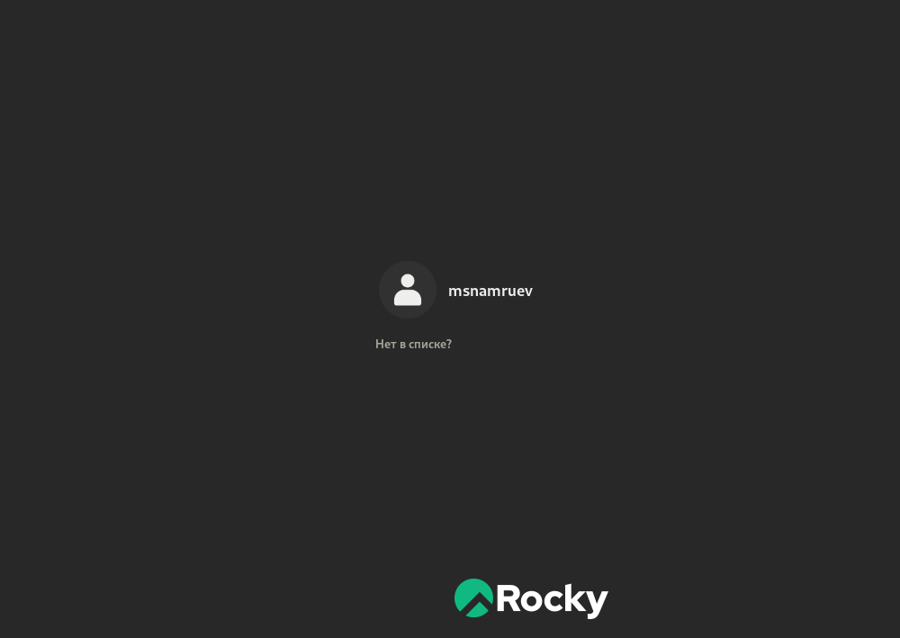{#fig:008 width=70%}

в меню устройтва подключаю образ дополнений гостевой ОС. (рис. [-@fig:009]).

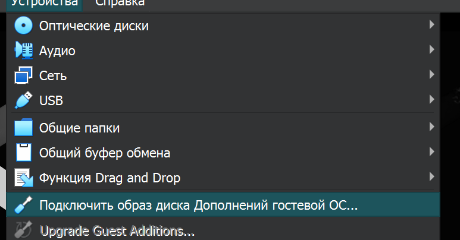{#fig:009 width=70%}

Загуржаю его и потом перезагружаю ОС.(рис. [-@fig:010]).

{#fig:010 width=70%}

## Установка имени пользователя и названия хоста

Так как имя хотса у меня было правильное пропускаю этот шаг.

ЛОЛ

## Домашнее задание

Использую команду dmesg.(рис. [-@fig:011]).

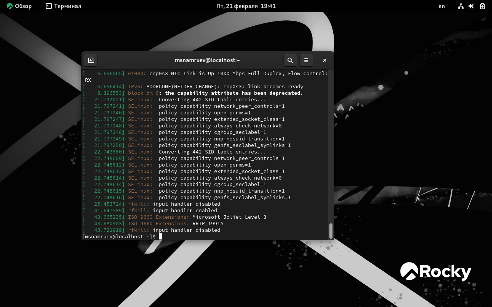{#fig:011 width=70%}

С помощью посика нахожу информацию о Версии ядра Linux.(рис. [-@fig:012]).

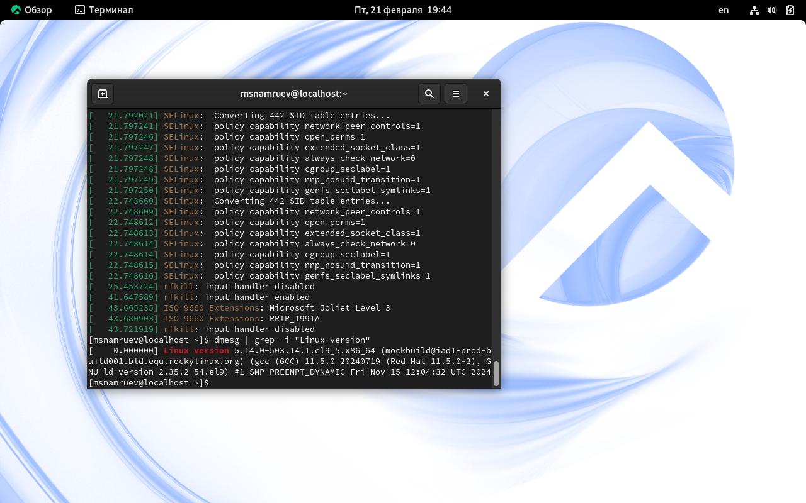{#fig:012 width=70%}

С помощью посика нахожу информацию о Частоте процессора.(рис. [-@fig:013]).

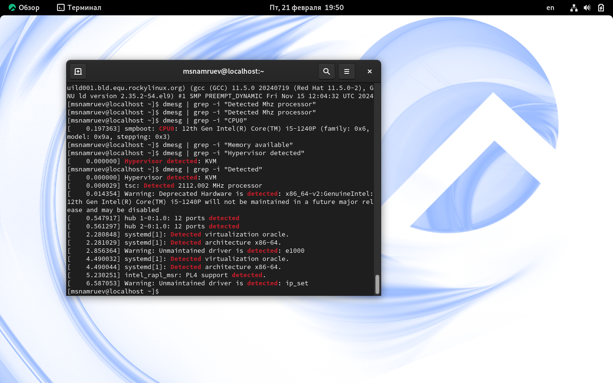{#fig:013 width=70%}

С помощью посика нахожу информацию о Модели процессора.(рис. [-@fig:014]).

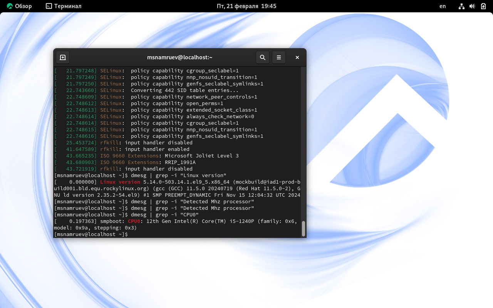{#fig:014 width=70%}

С помощью посика нахожу информацию о Объеме доступной оперативной памяти.(рис. [-@fig:015]).

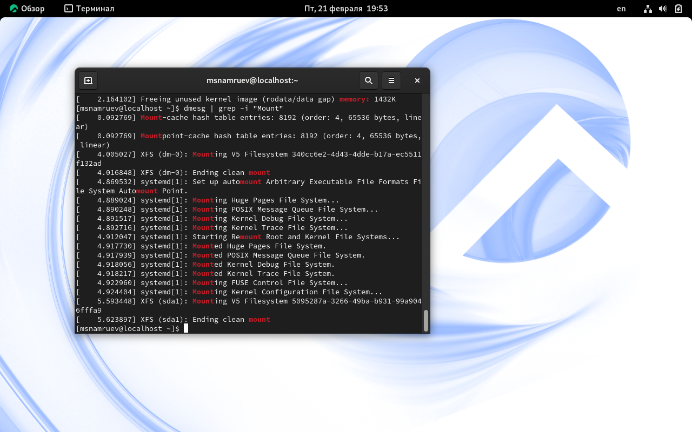{#fig:015 width=70%}

С помощью посика нахожу информацию о типе обнаруженного гипервизора.(рис. [-@fig:016]).

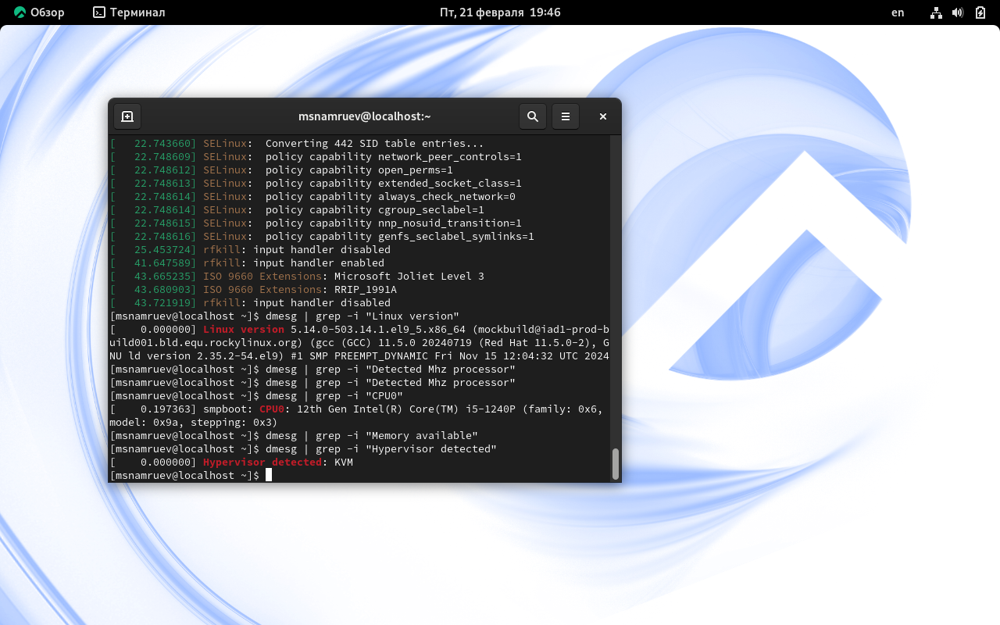{#fig:016 width=70%}

С помощью посика нахожу информацию о Типе файловой системы корневого раздела.(рис. [-@fig:017]).

{#fig:017 width=70%}

# Выводы

после выполения данной лабораторной работы я установил rocky linux на ВМ 

# Список литературы{.unnumbered}

::: {#refs}
:::
