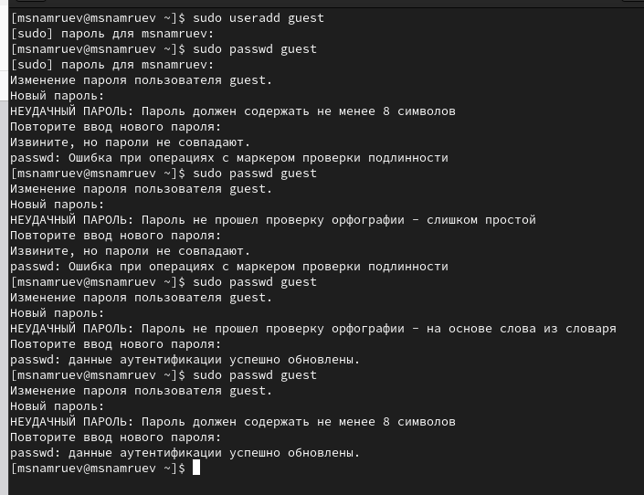
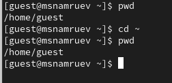
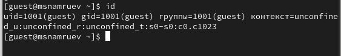
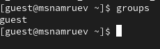
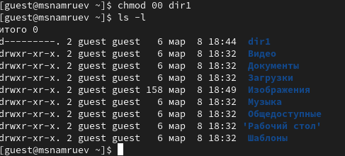
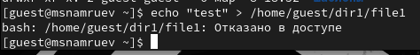
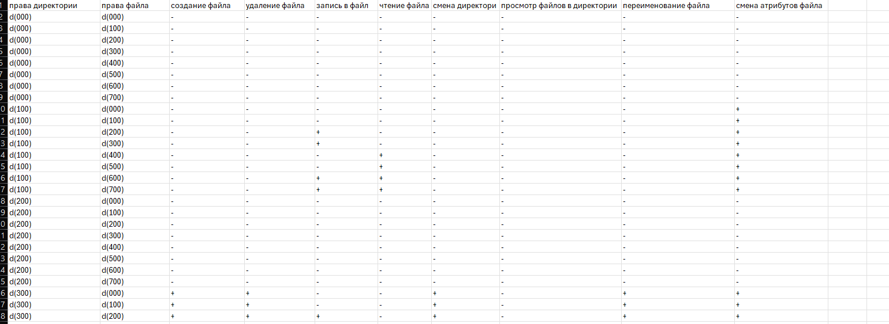
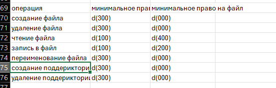

---
## Front matter
lang: ru-RU
title: лабораторная работа 2
subtitle: Основы информационной безопасности
author:
  - Намруев М. С.
institute:
  - Российский университет дружбы народов, Москва, Россия
date: 08 марта 2025

## i18n babel
babel-lang: russian
babel-otherlangs: english
## Fonts
mainfont: IBM Plex Sans
romanfont: IBM Plex Sans
sansfont: IBM Plex Sans
monofont: IBM Plex Sans
mathfont: STIX Two Math
mainfontoptions: Ligatures=Common,Ligatures=TeX,Scale=0.94
romanfontoptions: Ligatures=Common,Ligatures=TeX,Scale=0.94
sansfontoptions: Ligatures=Common,Ligatures=TeX,Scale=MatchLowercase,Scale=0.94
monofontoptions: Scale=MatchLowercase,Scale=0.94,FakeStretch=0.9
mathfontoptions:

## Formatting pdf
toc: false
toc-title: Содержание
slide_level: 2
aspectratio: 169
section-titles: true
theme: metropolis
header-includes:
 - \metroset{progressbar=frametitle,sectionpage=progressbar,numbering=fraction}
---

# Информация

## Докладчик

:::::::::::::: {.columns align=center}
::: {.column width="70%"}

  * Намруев Максим Саналович
  * 2 курс студент
  * Российский университет дружбы народов
  * [1132236035@rudn.ru](mailto:1132236035@rudn.ru)
  * <https://msnamruev.github.io/ru/>

:::
::: {.column width="30%"}

:::
::::::::::::::

## Цель работы

Получение практических навыков работы в консоли с атрибутами файлов, закрепление теоретических основ дискреционного разграничения доступа в современных системах с открытым кодом на базе ОС Linux

## Выполнение лабораторной работы

1. Создаю учетную запись guest

## Выполнение лабораторной работы

2. Задаю пароль для пользователя Guest

## Выполнение лабораторной работы

3. Вхожу в систему в систему от имени пользователя guest

4. Определяю директорию, в которой нахожусь.

## Выполнение лабораторной работы

5. Уточняю имя моего пользователя

## Выполнение лабораторной работы

6. Уточняю имя пользователя и его группу командой id

## Выполнение лабораторной работы

7. Сравниваю полученную информацию об имени пользователя с данными в приглашении командной строки.

8. Просматриваю файл /etc/passwd

## Выполнение лабораторной работы

9. Определяю существование в системе директории командой ls -l /home/

## Выполнение лабораторной работы

10. Проверяю какие расширенные атрибутивы установлены в поддериктории 

11. Создаю поддерикторию dir1

12. Снимаю с директорию все атрибутивы

## Выполнение лабораторной работы

13. Пытаюсь создать файл file1

## Выполнение лабораторной работы

14. Заполняю таблицу Установленные права и разрешённые действия

## Выполнение лабораторной работы

15. На основании этой таблицы определяю те или иные минимальные необходииые права для выполнения операций внутри директории

## Выводы

i waste my time

