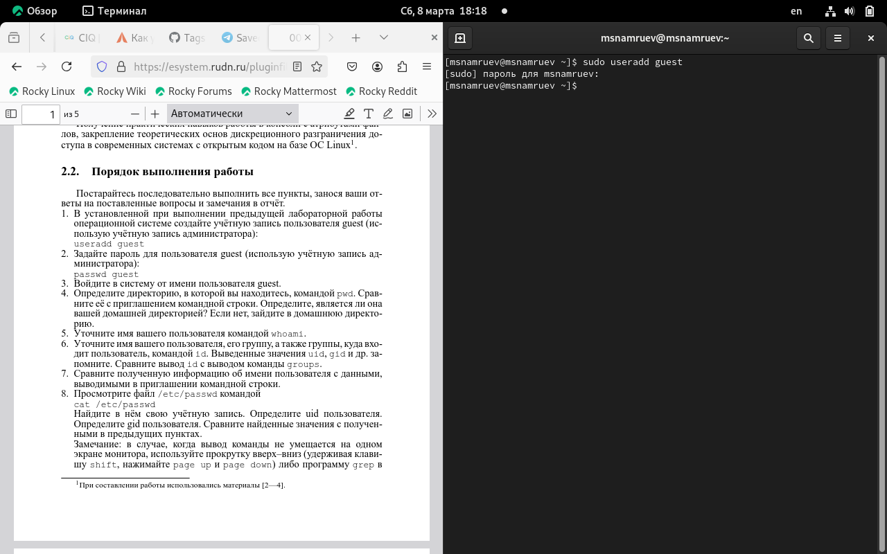
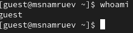
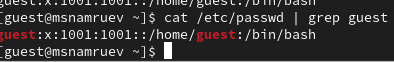
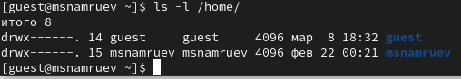

---
## Front matter
title: "Лабораторная работа 2"
subtitle: "Основы информационной безопасности"
author: "Намруев Максим Саналович"

## Generic otions
lang: ru-RU
toc-title: "Содержание"

## Bibliography
bibliography: bib/cite.bib
csl: pandoc/csl/gost-r-7-0-5-2008-numeric.csl

## Pdf output format
toc: true # Table of contents
toc-depth: 2
lof: true # List of figures
lot: true # List of tables
fontsize: 12pt
linestretch: 1.5
papersize: a4
documentclass: scrreprt
## I18n polyglossia
polyglossia-lang:
  name: russian
  options:
	- spelling=modern
	- babelshorthands=true
polyglossia-otherlangs:
  name: english
## I18n babel
babel-lang: russian
babel-otherlangs: english
## Fonts
mainfont: IBM Plex Sans
romanfont: IBM Plex Sans
sansfont: IBM Plex Sans
monofont: IBM Plex Sans
mathfont: STIX Two Math
mainfontoptions: Ligatures=Common,Ligatures=TeX,Scale=0.94
romanfontoptions: Ligatures=Common,Ligatures=TeX,Scale=0.94
sansfontoptions: Ligatures=Common,Ligatures=TeX,Scale=MatchLowercase,Scale=0.94
monofontoptions: Scale=MatchLowercase,Scale=0.94,FakeStretch=0.9
mathfontoptions:
## Biblatex
biblatex: true
biblio-style: "gost-numeric"
biblatexoptions:
  - parentracker=true
  - backend=biber
  - hyperref=auto
  - language=auto
  - autolang=other*
  - citestyle=gost-numeric
## Pandoc-crossref LaTeX customization
figureTitle: "Рис."
tableTitle: "Таблица"
listingTitle: "Листинг"
lofTitle: "Список иллюстраций"
lotTitle: "Список таблиц"
lolTitle: "Листинги"
## Misc options
indent: true
header-includes:
  - \usepackage{indentfirst}
  - \usepackage{float} # keep figures where there are in the text
  - \floatplacement{figure}{H} # keep figures where there are in the text
---

# Цель работы

Получение практических навыков работы в консоли с атрибутами файлов, закрепление теоретических основ дискреционного разграничения доступа в современных системах с открытым кодом на базе ОС Linux

# Выполнение лабораторной работы

1. Создаю учетную запись guest(рис. [-@fig:001]).

{#fig:001 width=70%}

2. Задаю пароль для пользователя Guest(рис. [-@fig:002]).

{#fig:002 width=70%}

3. Вхожу в систему в систему от имени пользователя guest

4. Определяю директорию, в которой нахожусь.(рис. [-@fig:003]).

{#fig:003 width=70%}

5. Уточняю имя моего пользователя(рис. [-@fig:004]).

{#fig:004 width=70%}

6. Уточняю имя пользователя и его группу командой id(рис. [-@fig:005]).(рис. [-@fig:006]).

{#fig:005 width=70%}

{#fig:006 width=70%}

7. Сравниваю полученную информацию об имени пользователя с данными в приглашении командной строки.

8. Просматриваю файл /etc/passwd(рис. [-@fig:007]).

{#fig:007 width=70%}

9. Определяю существование в системе директории командой ls -l /home/(рис. [-@fig:008]).

{#fig:008 width=70%}

10. Проверяю какие расширенные атрибутивы установлены в поддериктории 

11. Создаю поддерикторию dir1

12. Снимаю с директорию все атрибутивы(рис. [-@fig:009]).

{#fig:009 width=70%}

13. Пытаюсь создать файл file1(рис. [-@fig:010]).

{#fig:010 width=70%}

14. Заполняю таблицу Установленные права и разрешённые действия(рис. [-@fig:011]).

{#fig:011 width=70%}

15. На основании этой таблицы определяю те или иные минимальные необходииые права для выполнения операций внутри директории (рис. [-@fig:012]).

{#fig:012 width=70%}

# Выводы

i waste my time
