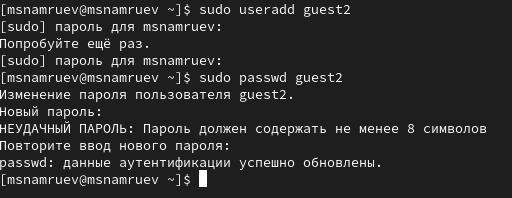
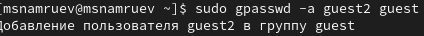
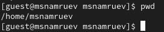
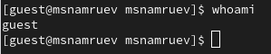
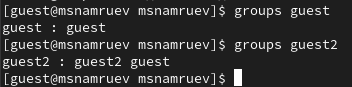
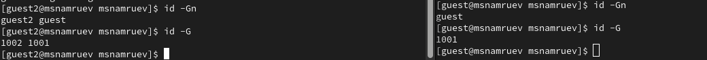

---
## Front matter
lang: ru-RU
title: Лабораторная рабоата №3
subtitle: Основы информационной безопасности
author:
  - Намруев М. С.
institute:
  - Российский университет дружбы народов, Москва, Россия
date: 22 марта 2025

## i18n babel
babel-lang: russian
babel-otherlangs: english
## Fonts
mainfont: IBM Plex Sans
romanfont: IBM Plex Sans
sansfont: IBM Plex Sans
monofont: IBM Plex Sans
mathfont: STIX Two Math
mainfontoptions: Ligatures=Common,Ligatures=TeX,Scale=0.94
romanfontoptions: Ligatures=Common,Ligatures=TeX,Scale=0.94
sansfontoptions: Ligatures=Common,Ligatures=TeX,Scale=MatchLowercase,Scale=0.94
monofontoptions: Scale=MatchLowercase,Scale=0.94,FakeStretch=0.9
mathfontoptions:

## Formatting pdf
toc: false
toc-title: Содержание
slide_level: 2
aspectratio: 169
section-titles: true
theme: metropolis
header-includes:
 - \metroset{progressbar=frametitle,sectionpage=progressbar,numbering=fraction}
---

# Информация

## Докладчик

:::::::::::::: {.columns align=center}
::: {.column width="70%"}

  * намруев максим Саналович
  * студент 2 курса
  * Российский университет дружбы народов
  * [1132236035@rudn.ru](mailto:1132236035@rudn.ru)
  * <https://msnamruev.github.io/ru/>

:::
::: {.column width="30%"}

## Цель работы

Получение практических навыков работы в консоли с атрибутами файлов для групп пользователей.

## Выполнение лабораторной работы

1. Создаю второго пользователя и задаю для него пароль

## Выполнение лабораторной работы

2. Добавляю пользователя guest2 в группу guest 

## Выполнение лабораторной работы

3. Осущевствляю вход в систему от двух разных пользователей с двух разных консолей

## Выполнение лабораторной работы

4. Уточняю имя пользователя, его группу, кто в неё входит, и к каким группам он пренадлежит.

## Выполнение лабораторной работы

5. Сравниваю это с информацией с файле /etc/group

## Выполнение лабораторной работы

6. От имени пользователя guest2 выполняю регистрацию пользователя guest2 в группе guest и от имени пользователя guest изменяю права, разрешив все действия для пользователей группы

## Выполнение лабораторной работы

7. От имени пользователя guest снимаю с директории /home/guest/dir1 все атрибуты

## Выполнение лабораторной работы

8. Заполняю таблицу 

## Выводы

8 способов как бросить дрочить хороший альбом!!

