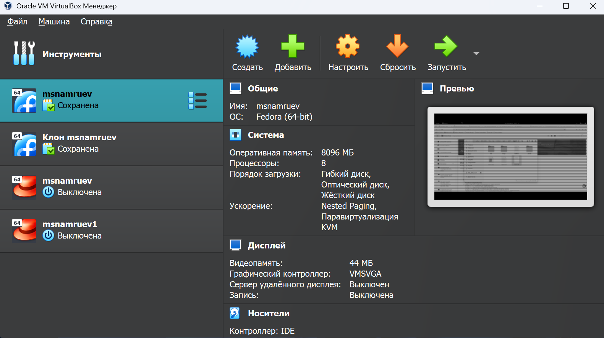
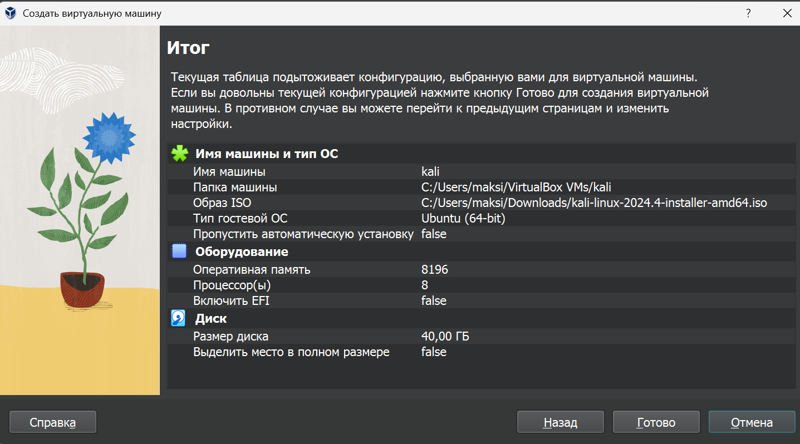
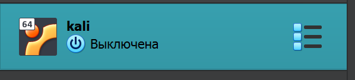
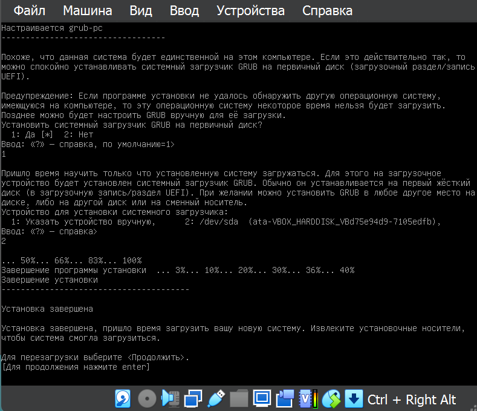
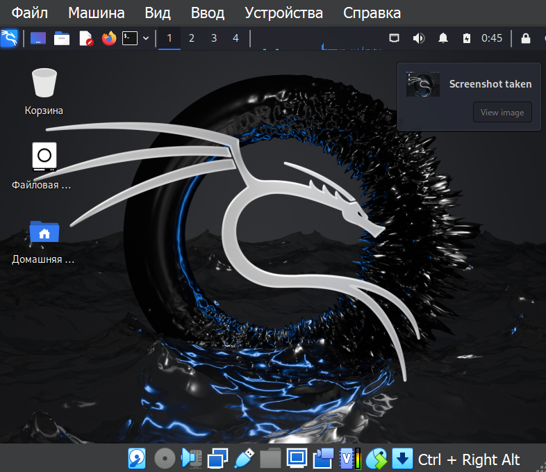

---
## Front matter
lang: ru-RU
title: ИП этап 1
subtitle: Основы информационной безопасности 
author:
  - Намруев М. С. 
institute:
  - Российский университет дружбы народов, Москва, Россия
date: 07 марта 2025

## i18n babel
babel-lang: russian
babel-otherlangs: english
## Fonts
mainfont: IBM Plex Sans
romanfont: IBM Plex Sans
sansfont: IBM Plex Sans
monofont: IBM Plex Sans
mathfont: STIX Two Math
mainfontoptions: Ligatures=Common,Ligatures=TeX,Scale=0.94
romanfontoptions: Ligatures=Common,Ligatures=TeX,Scale=0.94
sansfontoptions: Ligatures=Common,Ligatures=TeX,Scale=MatchLowercase,Scale=0.94
monofontoptions: Scale=MatchLowercase,Scale=0.94,FakeStretch=0.9
mathfontoptions:

## Formatting pdf
toc: false
toc-title: Содержание
slide_level: 2
aspectratio: 169
section-titles: true
theme: metropolis
header-includes:
 - \metroset{progressbar=frametitle,sectionpage=progressbar,numbering=fraction}
---

# Информация

## Докладчик

:::::::::::::: {.columns align=center}
::: {.column width="70%"}

  * Намруев Максим Саналович
  * студент 2 курс 
  * Российский университет дружбы народов
  * [1132236035@rudn.ru](mailto:1132236035@rudn.ru)
  * <https://msnamruev.github.io/ru/>

:::
::: {.column width="30%"}

:::
::::::::::::::

## Цель работы

Научиться основным способам тестирования веб приложений

## Задание

1. Установите дистрибутив Kali Linux в виртуальную машину.

2. В качестве среды виртуализации предлагается использовать VirtualBox.

## Выполнение лабораторной работы

Открываю VirtualBox 

## Выполнение лабораторной работы

Создаю новую ВМ с kali linux

## Выполнение лабораторной работы

Запускаю ВМ

## Выполнение лабораторной работы

Выполняю первичную настройку и задаю пароль для user и root

## Выполнение лабораторной работы

Дожидаюсь установки

## Выводы

я установил кали

