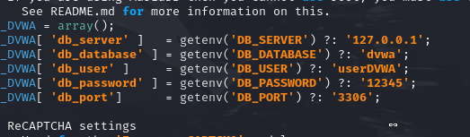
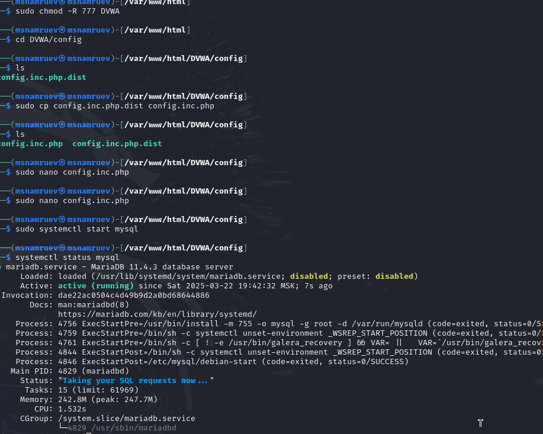

---
## Front matter
lang: ru-RU
title: ИП 2
subtitle: ОИБ
author:
  - Намруев М. С.
institute:
  - Российский университет дружбы народов, Москва, Россия
date: 01 января 1970

## i18n babel
babel-lang: russian
babel-otherlangs: english

## Fonts
mainfont: IBM Plex Sans
romanfont: IBM Plex Sans
sansfont: IBM Plex Sans
monofont: IBM Plex Sans
mathfont: STIX Two Math
mainfontoptions: Ligatures=Common,Ligatures=TeX,Scale=0.94
romanfontoptions: Ligatures=Common,Ligatures=TeX,Scale=0.94
sansfontoptions: Ligatures=Common,Ligatures=TeX,Scale=MatchLowercase,Scale=0.94
monofontoptions: Scale=MatchLowercase,Scale=0.94,FakeStretch=0.9
mathfontoptions:

## Formatting pdf
toc: false
toc-title: Содержание
slide_level: 2
aspectratio: 169
section-titles: true
theme: metropolis
header-includes:
 - \metroset{progressbar=frametitle,sectionpage=progressbar,numbering=fraction}
---

# Информация

## Докладчик

:::::::::::::: {.columns align=center}
::: {.column width="70%"}

  * Намруев Максим Саналович
  * 2 курс студент
  * Российский университет дружбы народов
  * [kulyabov-ds@rudn.ru](mailto:kulyabov-ds@rudn.ru)
  * <https://yamadharma.github.io/ru/>

:::
::: {.column width="30%"}

:::
::::::::::::::

## Цель работы

Установить DVWA

## Задание

1. Установить DVWA

## Выполнение лабораторной работы

Ввожу команды

## Выполнение лабораторной работы

меняю значения

## Выполнение лабораторной работы

Ещё команды

## Выполнение лабораторной работы

Ещё больше команд

## Выполнение лабораторной работы

ещё несколько значений

## Выводы

DVWA установено 

